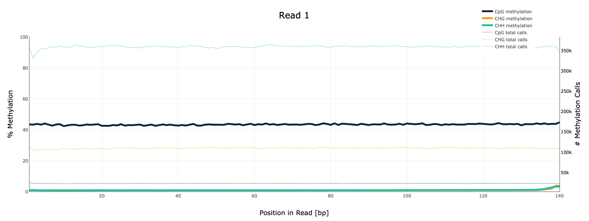

# hse23_hw1
[Colab-блокнот](https://colab.research.google.com/drive/1zHuZmJhwIQf1W2MDDBCw9fi8gowpL9Ay?usp=sharing)
## Риды
Число ридов, закартированных на участках 11347700-11367700; 40185800-40195800 и процентом дуплицированных прочтений для каждого образца    
BS-Seq | ch11: 11347700-11367700 | ch11: 40185800-40195800 | deduplication 
--- | --- | --- | ---
SRR5836473 | 1090 | 464 | 81.69
SRR3824222 | 2328 | 1062 | 97.08
SRR5836475 | 1456 | 630 | 90.92
## html-отчёты M-bias plot
На графиках изображена уровень метилирования каждой возможной позиции в прочтении.
### 8 cell

### Epiblast

### ICM

## Распределение метелирования цитозонов по хромосоме
В каждом образце частота и процент метелирования распередлены по разному. Для образцов SRR5836473(8 Cell) и SRR5836475(ICM) чаще всего встреяается 0% процентов метелирования, но образец SRR3824222(Epiblast) показывает хороший резульатат, где 100% метелирование встречается в почти половине случаев.     

